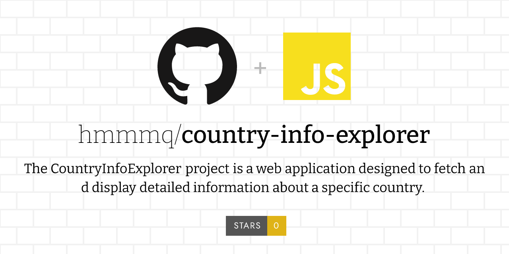
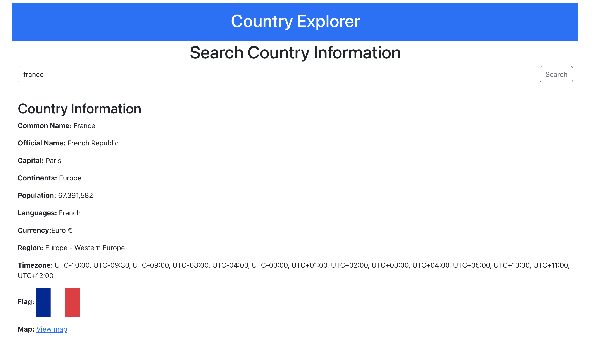
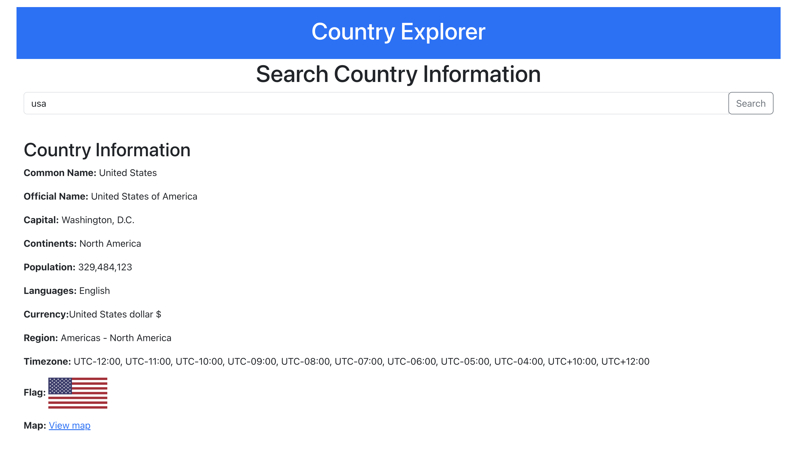
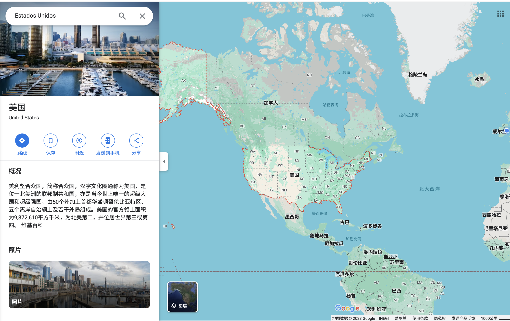

### Project Summary: CountryInfoExplorer

<!--  -->

**Objective and Functionality:**
The CountryInfoExplorer project is a web application designed to fetch and display detailed information about a specific country. Users input the name of a country, and the application retrieves and presents data including the country's name, capital, population, languages, currency, flag, and more.

#### Expample
<!--  -->
**Search France**

<!--  -->
**Search USA** 

<!--  -->
**Click USA Map Link**

**Technology Stack:**

- **Frontend**: Developed using React, a popular JavaScript library for building user interfaces. Leveraged Bootstrap for styling, ensuring a responsive and modern design.
- **Backend**: Implemented with Node.js and Express, creating a server that handles API requests. The backend interacts with the REST Countries API to fetch country data.
- **Development Tools**: Utilized tools such as Git for version control, and Visual Studio Code as the primary code editor.

**Challenges and Solutions:**

1. **Cross-Origin Resource Sharing (CORS) Issue**: 
   - **Problem**: Encountered CORS errors when the frontend (port 3000) tried to communicate with the backend (port 3001).
   - **Solution**: Implemented CORS in the Express server using the `cors` npm package to allow cross-origin requests.

2. **API Integration and Data Handling**:
   - **Problem**: Needed to integrate REST Countries API to fetch country data based on user input.
   - **Solution**: Used `axios` in the Node.js backend to call the REST Countries API and relay the data to the frontend.

3. **Frontend Rendering Logic**:
   - **Problem**: The frontend initially had issues rendering the fetched data, with challenges in handling empty or invalid responses.
   - **Solution**: Implemented conditional rendering in React, ensuring components render correctly only when data is available. Applied error handling in API requests to manage failed or unresponsive fetch operations.

4. **Design and Responsiveness**:
   - **Problem**: Required a user-friendly and responsive design for displaying country information.
   - **Solution**: Utilized Bootstrap to design a responsive layout. Used card components for structuring country data and tables for detailed information.

5. **Deployment Configuration**:
   - **Problem**: Faced issues with different port configurations between local development and production environments.
   - **Solution**: Configured environment-specific variables and ensured correct proxy settings in React for seamless integration between the frontend and backend.

**Conclusion:**

The CountryInfoExplorer project successfully demonstrates the integration of a React frontend with a Node.js/Express backend, showcasing key full-stack development skills. Through solving various technical challenges, the project enhanced understanding of API integration, cross-origin communication, responsive web design, and effective error handling in a full-stack environment.

